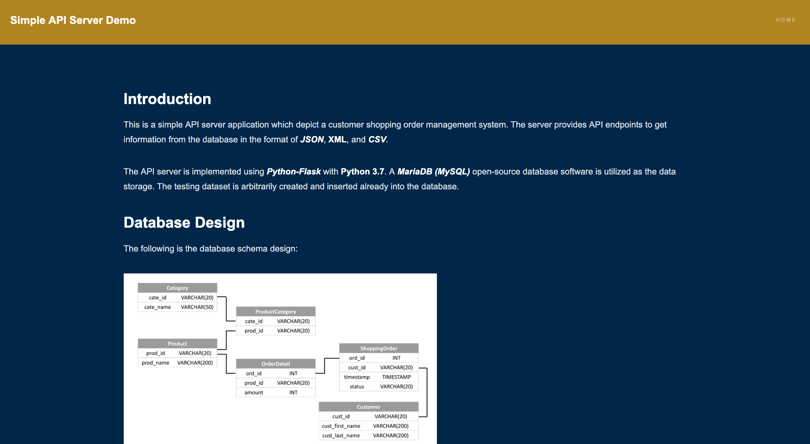

# Simple API Server Manual

* Author: Yu-Chang (Andy) Ho
* Date: Aug. 26, 2019
* Latest Update: Aug. 26, 2019

## Introduction

This is a simple API server application which depict a customer shopping order management system.
The server provides API endpoints to get information from the database in the format of ***JSON***, **XML**, and ***CSV***.

The API server is implemented using ***Python-Flask*** with **Python 3.7**. A ***MariaDB (MySQL)*** open-source database software is utilized as the data storage. The testing dataset is arbitrarily created and inserted already into the database.

**Please visit [https://hipposerver.ddns.net:8805](https://hipposerver.ddns.net:8805) for a live demo!**

## Database Design

The following is the database schema design:


<div style="page-break-after: always;"></div>

## Implemented API Endpoints

* Current API Version: ***v1***
* API Link: `/api/<API VER>/<API NAME>`
* Supported Output Format: ***JSON***, ***XML***, ***CSV***
* Default Parameters:

| Name     | Type     | Description                    | Default     |
|----------|----------|--------------------------------|-------------|
| `page `| Integer | (***Pagination***) page number | 1 |
| `size `| Integer | (***Pagination***) number of items per page | 10 |
| `format `| Text | Return data format, values in [ "**json**", "**xml**", "**csv**" ] | json |

* API Endpoints Links (All with Pagination enabled):

| API NAME     | Extra Parameters          | Description                    |
|--------------|---------------------------|--------------------------------|
| `/order/listOrder` | None | List all the received shopping orders. |
| `/order/showByID` | `ord_id` | Show the detail of an order by ID (`ord_id`). |
| `/order/orderByCustomer` | `cust_id` | Show orders by Customer using Customer ID (`cust_id`). |
| `/product/listProduct` | None | List all the products. |
| `/product/showByID` | `prod_id` | Show the detail of a product by ID (`prod_id`). |
| `/product/numOfSold` | `prod_id` | Show the number of sold per product, if product ID (`prod_id`) is given, return only the result with that ID. |
| `/product/numOfSoldByDate` | `start_date`, `end_date`, `range`, `prod_id` | Show the number of sold amount per product specified by a date range and grouping by `day`, `week`, or `month`. Parameter `start_date` and `end_date` are for the time filtering and `range` values in [ "**day**", "**week**", "**month**" ] to determine the grouping. If `range` is not specified, grouping by `date` is default. If a product Id (`prod_id`) is given, return the result only with that ID. |
| `/category/numOfSold` | `cate_id` | Show the number of sold per category, if category ID (`cate_id`) is given, return only the result with that ID. |
| `/category/purchasedByCustomer` | `cust_id` | Show the number of purchased amount in a certain category by a customer with ID (`cust_id`). |

<div style="page-break-after: always;"></div>

## How to Run the Program

### Step 1. Library Package Installation

Please make sure ***Python 3.6 or higher*** and ***MariaDB 5.7 or higher*** are installed on the machine. A `requirement.txt` file is for install the required library packages. Use the following command to install:

```bash
$ pip3 install -r requirements.txt
```

### Step 2. Create the Testing Database

In this repository, a folder `SQL` contains **two** sql command files for creating the testing database. Execute the file `build_datbase.sql` first then `build_dataset.sql` by the following command:

```bash
$ mysql -u <USER> -p < build_database.sql
# then
$ mysql -u <USER> -p < build_dataset.sql
```

Alternatively, you may use the pre-built testing database dump (file `dump.sql`) to create the database with testing dataset. Restore database using the command:

```bash
$  mysql -u <USER> -p < dump.sql
```

### Step 3. Change the Default Settings

In the program folder `API Code`, a file named `config.py` is for managing several global variables for the program. This include the database connection settings. Please change the **address**, **port**, **account**, and **account password** for accessing the previously created testing database on your machine.

<div style="page-break-after: always;"></div>

### Step 4. Start-up the server

After the database and testing dataset is ready, please navigate to the program folder `API Code`, a file named `app.py` is the program entry point. Use the following command to execute the program:

```bash
$ python3 app.py
```

If everything went well, you should see the following message:

```
 * Serving Flask app "app" (lazy loading)
 * Environment: production
   WARNING: This is a development server. Do not use it in a production deployment.
   Use a production WSGI server instead.
 * Debug mode: on
 * Running on http://127.0.0.1:5000/ (Press CTRL+C to quit)
 * Restarting with stat
 * Debugger is active!
 * Debugger PIN: 670-415-666
```

### Step 5. Access the API

Open up a web browser and head to the address:
```
http://<SERVER ADDR>:5000
```

The default address should be [http://127.0.0.1:5000](http://127.0.0.1:5000). This page should show parts of the documentation.
To try the API endpoints, please use the following format:
```
http://<SERVER ADDR>:5000/api/<API Ver>/<ENDPOINT LINK>
```

For example, to access the API `/order/listOrder`, use the address:
[http://127.0.0.1:5000/api/v1/order/listOrder](http://127.0.0.1:5000/api/v1/order/listOrder)

To add parameters, please use the following format:
```
http://<SERVER ADDR>:5000/api/<API Ver>/<ENDPOINT LINK>?<PARA 1>=<VALUE>&<PARA 2>=<VALUE>&...
```

For example, to **change output format to XML** of the previous example, use the address:
[http://127.0.0.1:5000/api/v1/order/listOrder?format=xml](http://127.0.0.1:5000/api/v1/order/listOrder?format=xml)


A simple welcoming page with the documentation should show up as follow:



<div style="page-break-after: always;"></div>

## Program File Description

This section introduced the program fils within this project.

```
project
│   ReadMe.pdf:                   This manual
│   additional_questions.pdf:     My responses of additional questions
│   requirements.txt:             Records the reqired library packages
│   demo_server.png:              Image of the server screenshot
│   schema.png:                   Image of the database schema design
│
└───API Code
│   │   app.py:                   API server endpoint main program
│   │   config.py:                Storing global variables and program settings
│   │   query.py:                 Storing the function for db connection
│   │   sql_command.py:           Storing the SQL commands
│   │   utils.py:                 Stroing several utility functions
│   │
│   └───web
│       └───static:               Store main page assets
│       │
│       └───templates:
│           │   index.html:       Server Main page
│           │   footer.html:      Footer information for index.html
│           │   documentation.md: Manual to show on index.html
│
└───SQL
    │   build_database.sql:       To build up the testing database
    │   build_dataset.sql:        To create the testing dataset
    │   dump.sql:                 Pre-built testing database dump
```